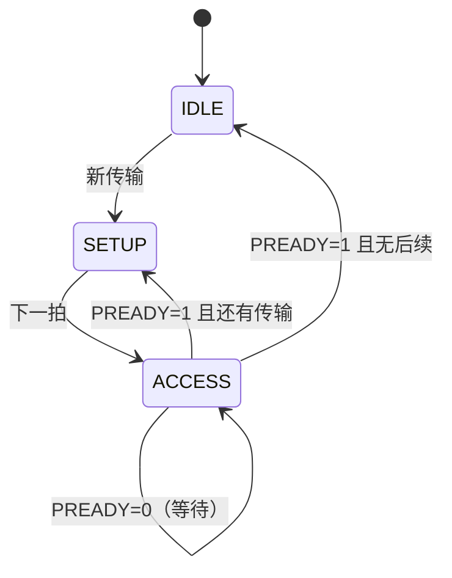

# AMBA APB 学习笔记：单通道两阶段，低速外设专用

> 适合读者：已经学过 AXI-Lite / AXI4，准备补全 AMBA 家族认知；希望用最便宜的协议理解"外设寄存器访问"。
>
> 学习目标：看懂 APB 波形；理解 SETUP/ACCESS 两阶段与完成条件；理解 PREADY 等待、PSTRB 字节使能与 PSLVERR 错误语义。

---

## 0. 文档定位与版本说明

本文主要依据 Arm《AMBA APB Protocol Specification》ARM IHI 0024E。该文档定义的是 APB5，并向下覆盖 APB2、APB3、APB4 的核心行为。

> **阅读主线：** 先记住 `SETUP -> ACCESS`，再看 `PREADY` 如何延长 ACCESS，最后学习 `PSTRB` 和 `PSLVERR`。

> **术语说明：本文统一使用传统命名 Master / Slave**（APB 新版规范称 Master / Slave，含义相同：Master 发起访问、常见实现是 AXI-to-APB bridge，Slave 是被访问的外设如 UART、GPIO、Timer；本文统一用 Master/Slave）。

版本演进简记：

```text
APB2: 基础（PSEL/PENABLE，无 PREADY）
APB3: + PREADY（等待状态）+ PSLVERR（错误响应）   ← 最重要
APB4: + PSTRB（字节使能）+ PPROT（保护属性）
APB5: + PWAKEUP（唤醒）、用户信号、RME（考得少）
```

> 面试只需记住：**"APB3 加 PREADY/PSLVERR，APB4 加 PSTRB/PPROT"** —— 这一句够了。

---

## 1. APB 是什么

**一句话定位**：APB 是"一条单车道小马路"——地址和数据共用一次传输，专给低速外设（GPIO、UART、Timer）用，便宜、简单、够用。

常见系统结构：

```text
CPU / DMA
    |
  AXI Interconnect
    |
AXI-to-APB Bridge        <- APB Master
    |
    +--------+---------+---------+
    |        |         |         |
  GPIO     UART      TIMER      SPI     <- APB Slave
```

图上关键点：

- **CPU/DMA 走 AXI** 到 interconnect；
- interconnect 地址译码后，把**发往低速外设的请求转给 bridge**；
- **bridge 把 AXI 事务翻译成 APB 时序**（对外就是 APB Master / 主机）；
- 外设（GPIO/UART/TIMER/SPI）只认 APB，挂在 bridge 下面。

APB 的特点：

- 同步协议，所有传输在 `PCLK` 上升沿采样。
- 不支持流水线。
- 一次传输至少需要两个时钟周期。
- 地址和数据不分成独立握手通道。
- 适合控制寄存器，不适合高带宽连续数据搬运。
- 通常不是 CPU 直接产生 APB 时序，而是桥接器将 AXI/AHB 请求转换为 APB。

### 1.1 与 AXI-Lite 的关键区别（先记住这张表）

| 对比项 | AXI-Lite | APB |
|---|---|---|
| 通道 | 5 条独立单向通道 | **1 条**（地址数据共用） |
| 握手 | 每通道 `VALID/READY` | `PSEL/PENABLE/PREADY` |
| 最少周期 | 可 1 拍 | **至少 2 拍** |
| 读写并发 | 可并发 | **不能并发** |
| 地址和数据 | 可任意先后 | **同拍稳定（绑定）** |
| 字节使能 | `WSTRB` | `PSTRB` |
| 错误响应 | `BRESP/RRESP`（4 种编码） | `PSLVERR`（1 位） |
| 响应粒度 | 写整笔 1 个 B；读每拍 RRESP | 每笔 1 个 |

> 记忆：**AXI-Lite 是"五车道高速路"，APB 是"单车道小马路"——便宜但一次只能走一辆车。**

### 1.2 为什么最少两个周期

APB 把一次传输拆成两个阶段：

```text
SETUP  : 选中外设，给出地址、方向、写数据和属性（PSEL=1, PENABLE=0）
ACCESS : 拉高 PENABLE，等待外设完成（PSEL=1, PENABLE=1）
```

**这两个阶段不能合并**（PENABLE 必须先 0 后 1），所以即使外设零等待，一次访问也至少占两个周期。

对比 AXI-Lite：VALID/READY 没有"先 0 后 1"的强制顺序，只要某个上升沿两者同时为 1 就完成，所以最快 1 拍。

> 本质区别：**APB 强制"两阶段先后"（PENABLE 0→1），AXI 允许"同拍握手"（VALID&&READY 同时 1）。**

### 1.3 APB 与存储器总线的直觉区别

APB 更像"访问一个寄存器"：

```text
选择设备 -> 告诉它访问哪个地址 -> 等它完成 -> 取回数据/错误
```

它不是用来追求每拍一个数据，也没有 burst、ID、乱序完成等机制。

---

## 2. 信号总览

### 2.1 基础信号

| 信号 | 方向 | 作用 |
|---|---|---|
| `PCLK` | Clock -> all | APB 时钟，上升沿采样 |
| `PRESETn` | System -> all | 低有效复位 |
| `PADDR` | Master -> Slave | **字节地址**，规范允许最高 32 位 |
| `PSELx` | Master -> Slave | 选中某个 Slave；通常每个外设一根选择线 |
| `PENABLE` | Master -> Slave | 表示进入 ACCESS 阶段 |
| `PWRITE` | Master -> Slave | `1` 写，`0` 读 |
| `PWDATA` | Master -> Slave | 写数据，宽度为 8、16 或 32 位 |
| `PRDATA` | Slave -> Master | 读数据，与 `PWDATA` 等宽 |

### 2.2 APB3 常用扩展

| 信号 | 方向 | 作用 |
|---|---|---|
| `PREADY` | Slave -> Master | `0` 延长 ACCESS（反压），`1` 允许传输完成 |
| `PSLVERR` | Slave -> Master | 最后一个 ACCESS 周期报告错误 |

### 2.3 APB4 常用扩展

| 信号 | 方向 | 作用 |
|---|---|---|
| `PSTRB` | Master -> Slave | 每个数据字节一位写使能 |
| `PPROT[2:0]` | Master -> Slave | 特权、安全、数据/指令属性 |

APB5 还定义了可选的 `PWAKEUP`、用户信号、RME 地址空间扩展和接口 check 信号。初学者实现外设时，先完成基础信号、`PREADY`、`PSLVERR` 和 `PSTRB` 即可。

---

## 3. 三个工作状态

APB 可以用三状态状态机理解：



| 状态 | `PSEL` | `PENABLE` | 含义 |
|---|---|---:|---|
| IDLE | 0 | 0 | 没有传输 |
| SETUP | 1 | 0 | 给出本次传输信息 |
| ACCESS | 1 | 1 | Slave 执行并给出完成状态 |

### 3.1 最重要的完成条件

**完成条件是 `PSEL && PENABLE && PREADY`**。只有在时钟上升沿同时采到三个信号为 1，当前传输才完成。

**不要只用 `PREADY` 判断完成**，因为规范允许 `PENABLE=0` 时 `PREADY` 取任意值，零等待外设甚至可以把它常接 `1`。

### 3.2 `PENABLE` 不是"外设使能"

`PENABLE` 是整个 APB 接口**共享的阶段信号**，不是某个外设独有的片选。

某个 Slave 判断自己是否处于有效访问阶段，应使用本外设的 `PSEL_this && PENABLE`，**不能只看共享的 `PENABLE`**。

---

## 4. 基本读写传输

### 4.1 零等待写

```text
上升沿       T1              T2              T3
阶段       SETUP           ACCESS          完成后
PSEL         1               1               0/1
PENABLE      0               1               0
PWRITE       1               1               下一传输
PADDR       addr            addr             下一地址
PWDATA      data            data             下一数据
PREADY       X               1               X
                         T3 上升沿完成
```

流程：

1. Master 在 SETUP 阶段拉高 `PSEL`。
2. 同时给出稳定的 `PADDR`、`PWRITE=1`、`PWDATA`、`PSTRB` 和属性。
3. 下一周期拉高 `PENABLE`，进入 ACCESS。
4. 若 `PREADY=1`，在该 ACCESS 周期末的上升沿完成写传输。
5. 完成后 `PENABLE` 必须拉低。

### 4.2 带等待状态的写（PREADY 反压）

```text
阶段       SETUP     ACCESS     ACCESS     ACCESS      完成后
PSEL         1          1          1          1           0/1
PENABLE      0          1          1          1           0
PREADY       X          0          0          1           X
PADDR       A1         A1         A1         A1         next
PWDATA      D1         D1         D1         D1         next
```

**PREADY 就是 APB 的反压**（和 AXI 的 READY 一个道理）：外设没准备好就拉 0，准备好拉 1。

只要处于 ACCESS 且 `PREADY=0`，Master 必须保持本次传输信息不变：

- `PADDR`
- `PWRITE`
- `PSELx`
- `PENABLE`
- `PWDATA`
- `PSTRB`
- `PPROT`
- 对应用户信号

这条规则是 APB 协议的核心检查点。

> 记忆：**PREADY=0 = 外设还没准备好，你举着的东西（地址/数据）不能换** —— 和 AXI"阻塞期间 payload 稳定"同一个道理。

### 4.3 零等待读

1. SETUP：Master 给出 `PSEL=1、PENABLE=0、PWRITE=0` 和目标地址。
2. ACCESS：下一周期把 `PENABLE` 拉高。
3. 完成：`PSEL && PENABLE && PREADY` 同时为 1 时，采样 `PRDATA/PSLVERR`。

### 4.4 带等待读

`PREADY=0` 可以延长 ACCESS 任意多个周期。等待期间 Master 保持地址、方向、选择和属性稳定。

Master 只在最终完成沿采样 `PRDATA`，所以等待期间的数据不应被提前使用。

工程上常让 Slave 在等待时也保持 `PRDATA` 稳定，便于调试。

### 4.5 读传输时的 `PSTRB`

规范明确要求：**读传输中所有 `PSTRB` 位必须为 `0`**（字节使能只用于写，读没意义）。

---

## 5. 连续传输

### 5.1 连续访问同一个 Slave

如果下一笔仍访问同一个外设，**`PSEL` 可以保持为 `1`，但 `PENABLE` 必须在两笔传输之间回到 `0`**：

```text
ACCESS(old) -> SETUP(new) -> ACCESS(new)
PSEL       1       1             1
PENABLE    1       0             1
```

不能连续两个完成周期都保持 `PENABLE=1`，否则没有新传输的 SETUP 阶段。

> 记忆：**PSEL 是"选谁"（可以一直选着），PENABLE 是"发令枪"（每笔都要重新上膛）。**

### 5.2 切换到另一个 Slave

通常每个外设有独立的 `PSELx`。完成旧访问后，下一个 SETUP 周期切换选择线：

```text
old_PSEL = 0
new_PSEL = 1
PENABLE  = 0
```

### 5.3 吞吐率直觉

零等待、连续传输情况下，一笔 APB 访问仍至少占两拍：

```text
SETUP0 ACCESS0 SETUP1 ACCESS1 SETUP2 ACCESS2
```

因此 APB 不适合追求每拍传一个数据（对比 AXI burst 一地址多拍）。

---

## 6. 写字节使能 PSTRB

**PSTRB 就是 APB 版的 WSTRB** —— 每一位控制一个写数据字节：

```text
PSTRB[0] -> PWDATA[7:0]
PSTRB[1] -> PWDATA[15:8]
PSTRB[2] -> PWDATA[23:16]
PSTRB[3] -> PWDATA[31:24]
```

32 位数据总线下：

| `PSTRB` | 含义 |
|---|---|
| `4'b0001` | 只写最低字节 |
| `4'b0011` | 写低 16 位 |
| `4'b1100` | 写高 16 位 |
| `4'b1111` | 写完整 32 位 |
| `4'b0000` | 没有字节被更新 |

实现寄存器写入时，应逐字节检查 `PSTRB[i]`，只更新对应的 `PWDATA[i*8 +: 8]`。

### 6.1 常见错误

- 把 `PSTRB` 当成位写使能；它是**字节**写使能。
- 写寄存器时无条件覆盖全部字节。
- 读传输时仍驱动非零 `PSTRB`。
- 接口声明的数据宽度不是 8 的整数倍。

---

## 7. 错误响应 PSLVERR

`PSLVERR` 只在 `PSEL && PENABLE && PREADY` 同时成立的最后一个 ACCESS 周期有协议意义。

典型错误来源：

- 地址不存在。
- 写只读寄存器。
- 读只写寄存器。
- 不支持的 `PSTRB` 组合。
- 权限检查失败。

### 7.1 错误并不保证"没有副作用"（重点语义）

**PSLVERR=1 只是说"这次访问的完成状态是失败"，但不保证访问过程中没有产生副作用。**

为什么？因为副作用发生在访问**执行过程中**，而 PSLVERR 只是**结束时汇报的最终状态**。APB 没有"事务回滚"机制，报错后已发生的动作不会自动撤销。

| 场景 | 报错时可能已经发生 |
|---|---|
| 写 FIFO | 数据可能已 push 进 FIFO |
| 读 status（read-to-clear） | 中断标志可能已被清除 |
| 写 command 寄存器 | 外设可能已被启动 |

> 面试表述：**"收到 PSLVERR 不能假设状态没变。软件应该重新读取外设状态确认实际影响，而不是直接把报错当成'什么都没发生'。"**

### 7.2 桥接后的响应

AXI-to-APB bridge 通常把：

```text
APB read  PSLVERR -> AXI RRESP
APB write PSLVERR -> AXI BRESP
```

**关键**：bridge 不能凭空造 DECERR —— DECERR 通常由 interconnect 产生（地址无法译码），APB 侧只有 PSLVERR 一种错误。

> 面试说：**"APB 的错误只有 PSLVERR，桥把它映射成 AXI 的 SLVERR；DECERR 是 interconnect 的事，不归 APB。"**

---

## 8. 保护属性 PPROT

**PPROT[2:0] 和 AXI 的 AxPROT 一模一样**：

| 位 | `0` | `1` |
|---|---|---|
| `PPROT[0]` | Normal | Privileged |
| `PPROT[1]` | Secure | Non-secure |
| `PPROT[2]` | Data | Instruction |

`PPROT[2]` 更像提示，不一定能准确代表所有系统行为。

一个外设可以根据 `PPROT` 实现权限检查，例如只有 privileged access 才能写看门狗控制寄存器。

> 记忆：**PPROT = APB 版的 AxPROT，3 位：特权/安全/指令。简单外设通常忽略，安全系统会据此拒绝访问。**

---

## 9. 地址与寄存器映射

### 9.1 `PADDR` 是字节地址

PADDR 表示**字节地址**（不是字地址）。32 位寄存器常见映射：

| 地址 | 寄存器 |
|---|---|
| `0x00` | CTRL |
| `0x04` | STATUS |
| `0x08` | DATA |
| `0x0C` | IRQ_EN |

32 位寄存器通常忽略 `PADDR[1:0]`，使用更高位完成 word 地址译码。

### 9.2 非对齐地址

规范允许 `PADDR` 出现相对数据宽度非对齐的值，但结果是 UNPREDICTABLE。Slave 可能使用原地址、对齐后的地址或报错。

工程上通常约束 32 位访问满足 `addr[1:0]==0`，除非测试目标就是验证非法或非对齐访问。

---

## 10. 一个简单的 APB interface

```systemverilog
interface apb_if #(
    parameter int ADDR_WIDTH = 32,   // 地址宽度，字节寻址
    parameter int DATA_WIDTH = 32    // 数据宽度，8/16/32 可选
) (
    input logic PCLK,     // APB 时钟，所有信号上升沿采样
    input logic PRESETn   // 低有效复位
);
    logic [ADDR_WIDTH-1:0]      PADDR;    // 字节地址
    logic                       PSEL;     // 本外设被选中（地址译码结果）
    logic                       PENABLE;  // ACCESS 阶段标志
    logic                       PWRITE;   // 1=写 0=读
    logic [DATA_WIDTH-1:0]      PWDATA;   // 写数据
    logic [DATA_WIDTH/8-1:0]    PSTRB;    // 字节写使能（APB4+）
    logic [2:0]                 PPROT;    // 保护属性（APB4+）
    logic                       PREADY;   // 外设就绪（0 则反压延长 ACCESS）
    logic [DATA_WIDTH-1:0]      PRDATA;   // 读数据，完成沿采样
    logic                       PSLVERR;  // 错误响应，完成沿有效
endinterface
```

这里列出 APB 协议的全部核心信号。

---

## 11. 总结

### 11.1 学习重点排序

| 优先级 | 学习内容 |
|---|---|
| 🔴 高 | `SETUP -> ACCESS`、完成条件、等待期间保持稳定 |
| 🟡 中 | 连续传输、`PSTRB`、`PSLVERR`、地址译码 |
| 🟢 进阶 | `PPROT`、APB5 扩展、interface 和实现优化 |

### 11.2 易错点

| 易错理解 | 正确理解 |
|---|---|
| `PREADY=1` 就完成 | 必须同时满足 `PSEL && PENABLE && PREADY` |
| `PENABLE` 可以一直为 1 | 每笔传输前都需要一个 SETUP 周期 |
| 等待时可以修改地址 | `PREADY=0` 时请求字段必须保持稳定 |
| 写副作用在进入 ACCESS 时发生 | 应绑定到真正的完成沿 |
| 连续访问必须拉低 `PSEL` | 同一外设可保持 `PSEL=1`，但 `PENABLE` 必须回到 0 |
| `PSLVERR=1` 表示操作已回滚 | 规范不保证没有副作用 |

### 11.3 最重要的 10 条规则

1. APB 是同步、非流水协议，每笔至少两拍。
2. SETUP 时 `PSEL=1, PENABLE=0`。
3. ACCESS 时 `PSEL=1, PENABLE=1`。
4. 只有 `PSEL && PENABLE && PREADY` 才完成。
5. `PREADY=0` 时 Master 必须保持传输信息稳定。
6. 每笔新传输前 `PENABLE` 都必须回到 `0`。
7. 读数据和错误响应在完成沿采样。
8. `PSTRB` 每一位控制一个写数据字节，读时必须为 0。
9. 外设副作用应只绑定到完成事件。
10. `PSLVERR` 不保证操作没有产生副作用。

---

## 参考资料

- Arm, *AMBA APB Protocol Specification*, ARM IHI 0024E, 2023。
- Arm, *Introduction to AMBA AXI4*, 102202 Issue 01, 2020（用于理解 AXI-to-APB 的系统定位）。
