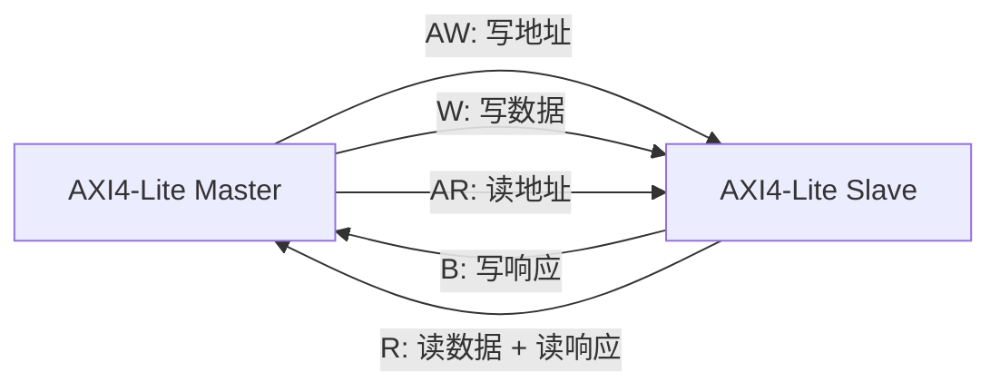
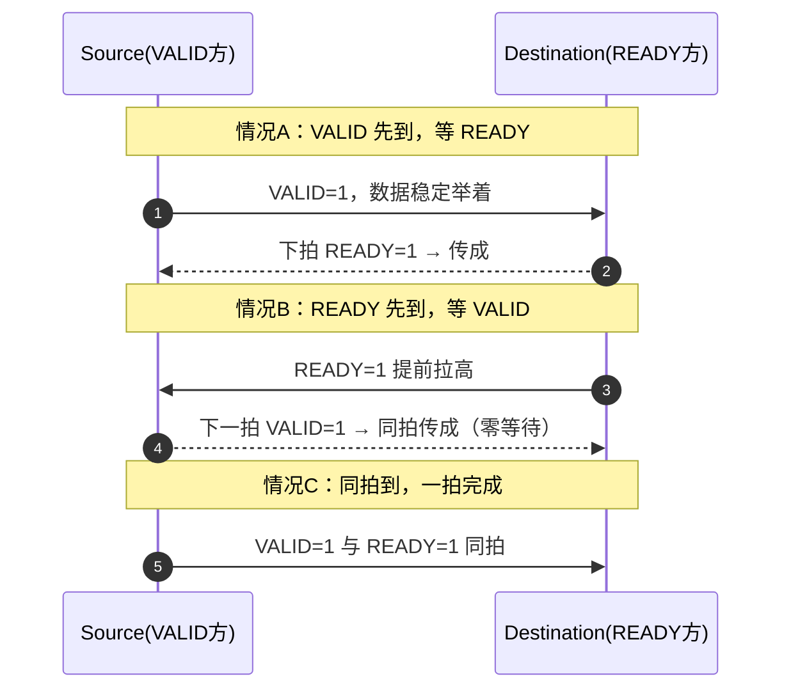
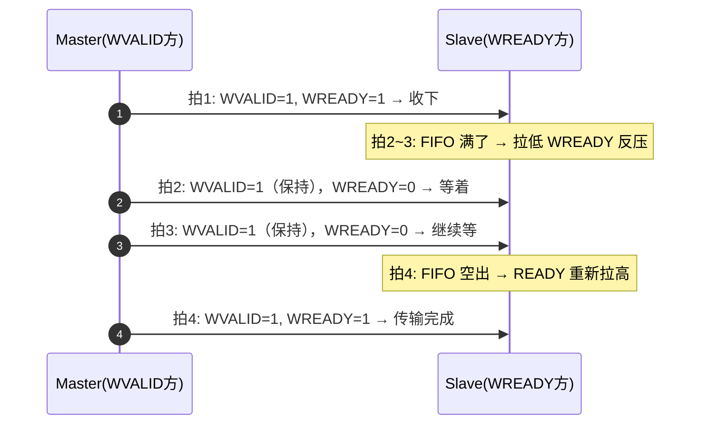
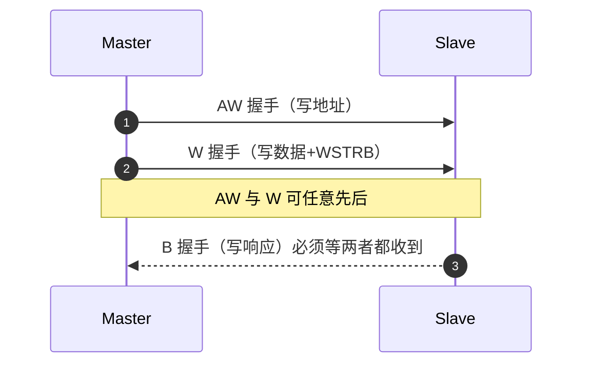

# AMBA AXI4-Lite 学习笔记：五通道握手与寄存器接口

> 适合读者：零基础或已学过 APB，准备接触 AXI；先用协议子集理解五通道、VALID/READY 和独立握手。
>
> 学习目标：读懂 AXI4-Lite 波形；理解 AW/W 独立握手和响应依赖；掌握五通道与握手规则。

---

## 0. 文档定位与版本边界

AXI4-Lite 是 AXI4 的简化子集，主要用于控制寄存器接口。

本文以 Arm IHI 0022H 的 AXI4-Lite 章节为主要依据，并用《Introduction to AMBA AXI4》解释五通道和握手。

你提供的 IHI 0022L 属于更新的 AMBA 5 规范。阅读时可以参考通用思想，但不要把其中 AXI5-Lite 的新增信号当成 AXI4-Lite 必选信号。

> **阅读主线：** 五个通道各自握手；写地址 AW 和写数据 W 可以任意先后；收到两者后才产生写响应 B。

> **术语说明：本文统一使用传统命名 Master / Slave**（新版规范称 Manager/Subordinate 或 Requester/Completer，含义相同；工程和 IP 文档中仍大量使用 Master/Slave，本文保持一致）。

---

## 1. AXI4-Lite 是什么

**一句话定位**：AXI4-Lite 是 CPU 和外设之间的一条"快递通道"——发一个请求、传一个数据、收一个回执，一次办完一件事。

AXI4-Lite 可以理解为：

```text
保留 AXI 的五个独立通道和 VALID/READY 握手
去掉 burst、ID、乱序完成和 exclusive access
每次只传输一个 data beat
```

典型用途：

- CPU 配置 DMA 寄存器。
- 读写 GPIO、UART、Timer 等控制寄存器。
- FPGA 中处理器系统访问自定义 IP 寄存器。
- 低吞吐量状态和控制通路。

不适合：

- 大块内存搬运。
- 高吞吐量连续数据。
- 依赖 burst、多个 ID 或乱序返回的场景。

### 1.1 与 APB 的关键区别

| 对比项 | APB | AXI4-Lite |
|---|---|---|
| 通道 | 地址、数据共用一次两阶段传输 | 5 个独立通道 |
| 握手 | `PSEL/PENABLE/PREADY` | 每通道 `VALID/READY` |
| 最少周期 | 至少 2 拍 | 某个通道可 1 拍握手 |
| 读写并发 | 不支持 | 读、写通路可并发 |
| 写地址和写数据 | 同一传输中同时稳定 | 两个独立通道，可任意先后 |
| 响应 | `PSLVERR` | `BRESP/RRESP` |

AXI4-Lite 语法看似只是信号更多，真正难点是"通道彼此独立"。

---

## 2. 五个通道与信号



| 通道 | 方向 | 内容 |
|---|---|---|
| AW | Master -> Slave | 写地址和写保护属性 |
| W | Master -> Slave | 写数据和字节使能 |
| B | Slave -> Master | 写响应 |
| AR | Master -> Slave | 读地址和读保护属性 |
| R | Slave -> Master | 读数据和读响应 |

**记忆技巧**：A=地址、W=写、R=读、B=Backward（反向）。写流程三步走 AW→W→B，读流程两步走 AR→R。

### 2.1 为什么读没有单独响应通道

**一句话**：数据从哪边回去，响应就跟数据走；反方向回不去就单独开通道。

- **读方向**：读数据本来就是 Slave → Master，`RRESP` 可以与 `RDATA` 一起放在 R 通道顺路带回，不需要额外通道。
- **写方向**：写数据是 Master → Slave（去程），写结果要反方向返回，所以必须单独开一条 B 通道。

### 2.2 全局信号

| 信号 | 作用 |
|---|---|
| `ACLK` | 所有输入在上升沿采样 |
| `ARESETn` | 低有效复位（平时为 1，拉 0 才复位） |

### 2.3 AW 写地址通道

| 信号 | 方向 | 作用 |
|---|---|---|
| `AWADDR` | M -> S | 写地址 |
| `AWPROT[2:0]` | M -> S | 特权、安全、指令/数据属性 |
| `AWVALID` | M -> S | 写地址有效 |
| `AWREADY` | S -> M | Slave 可以接收写地址 |

### 2.4 W 写数据通道

| 信号 | 方向 | 作用 |
|---|---|---|
| `WDATA` | M -> S | 写数据 |
| `WSTRB` | M -> S | 每字节写使能 |
| `WVALID` | M -> S | 写数据有效 |
| `WREADY` | S -> M | Slave 可以接收写数据 |

### 2.5 B 写响应通道

| 信号 | 方向 | 作用 |
|---|---|---|
| `BRESP[1:0]` | S -> M | 写响应状态 |
| `BVALID` | S -> M | 写响应有效 |
| `BREADY` | M -> S | Master 可以接收写响应 |

### 2.6 AR 读地址通道

| 信号 | 方向 | 作用 |
|---|---|---|
| `ARADDR` | M -> S | 读地址 |
| `ARPROT[2:0]` | M -> S | 访问属性 |
| `ARVALID` | M -> S | 读地址有效 |
| `ARREADY` | S -> M | Slave 可以接收读地址 |

### 2.7 R 读数据通道

| 信号 | 方向 | 作用 |
|---|---|---|
| `RDATA` | S -> M | 读数据 |
| `RRESP[1:0]` | S -> M | 读响应状态 |
| `RVALID` | S -> M | 读数据和响应有效 |
| `RREADY` | M -> S | Master 可以接收读返回 |

---

## 3. AXI4-Lite 去掉了什么

AXI4-Lite 的核心限制：

- 每笔事务只有 1 个 data beat。
- 数据总线宽度固定为 32 位或 64 位。
- 不支持 AXI ID。
- 不支持 burst。
- 不支持 exclusive access。
- 不支持数据交织。
- 所有事务按顺序完成。

与完整 AXI4 信号的等效关系：

| 完整 AXI4 字段 | AXI4-Lite 等效含义 |
|---|---|
| `AxLEN` | 固定为 0，即 1 beat |
| `AxSIZE` | 固定为数据总线宽度 |
| `AxBURST` | 无意义，因为只有 1 beat |
| `AxLOCK` | 固定 Normal access |
| `AxCACHE` | 固定 Non-modifiable、Non-bufferable |
| `WLAST/RLAST` | 每笔都是最后一拍，等效为 1 |
| ID signals | 不存在 |

**Outstanding（未完成事务）**：请求已经接收，但最终响应还没有返回——白话说就是"已经下单，但还没有收完货"。AXI4-Lite 可以同时存在多笔这样的事务，但没有 ID 可供区分，因此响应必须保持顺序。

最简单的 Slave 可以在上一笔完成前拉低 `READY`，把自己限制成一次只处理一笔——这是工程选择，不是协议强制。

---

## 4. VALID/READY 握手

**每个通道都使用相同规则**：

```systemverilog
// 该表达式必须在 ACLK 上升沿采样；组合值为 1 才完成一次通道 transfer。
transfer = VALID && READY;
```

**核心规则（唯一规则）**：传输只发生在某个时钟上升沿 VALID 和 READY **同时为 1** 的那一拍。

### 4.1 Source 与 Destination

在每个通道里，Source 是"提供内容的一方"，负责 `VALID`；Destination 是"接收内容的一方"，负责 `READY`。**它们不一定分别等于 Master 和 Slave。**

| 通道 | Source：驱动 VALID | Destination：驱动 READY |
|---|---|---|
| AW | Master | Slave |
| W | Master | Slave |
| B | Slave | Master |
| AR | Master | Slave |
| R | Slave | Master |

**"VALID 一定由 Master 驱动"是错误的。** B、R 通道的 Source 是 Slave。

可以把握手想成打电话：Source 说"东西已经放好了"（VALID），Destination 说"我现在能接"（READY）。只有两句话在同一个上升沿同时成立，传输才发生。

### 4.2 三种合法时序

```text
情况 A：VALID 先到，READY 后到（快递员先到门口，等你伸手）
情况 B：READY 先到，VALID 后到（你提前等着，货一到立刻接走，零等待）
情况 C：VALID 与 READY 同拍到（双方同时就绪，一拍完成）
```

只要在某个上升沿两者同时为 `1`，该通道完成一次传输。**"变 1 的那拍就是传成的那拍"，不需要额外再等一拍。**

三种情况的波形示意：



### 4.3 Source 的铁律

Source 不允许等待 READY 后才拉高 VALID。

```text
错误：Master 等 AWREADY，Slave 又等 AWVALID -> 永久死锁
```

正确规则：

1. Source 有有效 payload 时自主拉高 VALID。
2. 一旦 VALID 拉高，在握手完成前必须保持 VALID。
3. 握手完成前 payload 必须稳定。

**违反第 1 条会死锁**：双方互等，谁也等不到谁——这是面试必考场景。

### 4.4 Destination 可以等待 VALID

Destination 可以：

- 提前拉高 READY。
- 看到 VALID 后再拉高 READY。
- 在 VALID 出现前自由改变 READY。

为了单拍接收，常建议 READY 在确实有容量时提前为高。

**READY 能否持续保持高电平？可以。** 只要接收方有容量（单拍接收优化）；没容量时拉低 READY 反压。READY 与 VALID 不对称：READY 可以等 VALID，VALID 不能等 READY。

### 4.5 反压（Backpressure）

**反压 = 接收方暂时没有能力接收，通过拉低 READY 告诉发送方"先别发，等我缓过来"。**

| 场景 | 说明 |
|---|---|
| FIFO/buffer 满了 | 收进来的数据还没来得及处理 |
| 处理慢 | 比如慢速外设一拍只能处理一点点 |
| 响应槽占满 | B/R 响应还没被 Master 接走 |

被反压时，发送方必须：**VALID 保持 1（数据还举着）**、**payload 保持稳定（不能换数据）**——这就是"阻塞期间 payload 必须稳定"的实战场景。

反压示意：



### 4.6 接口组合路径限制

AXI 接口输入到输出之间不能存在组合路径。实际设计通常使用寄存器、FIFO 或 skid buffer 断开组合依赖。

例如，不应简单写成：

```systemverilog
// 错误示例：AWREADY 直接由输入 WVALID 组合产生，既形成输入到输出的组合路径，
// 又错误地把本应独立的 AW、W 两个通道绑在一起。
assign AWREADY = WVALID; // 输入直接组合影响输出，且耦合两个独立通道
```

---

## 5. 写事务与写响应

一次 AXI4-Lite 写事务包含：

```text
一次 AW 握手 + 一次 W 握手 + 一次 B 握手
```

关键依赖：

```text
AW 与 W：没有固定先后关系
BVALID：必须等 AW 和 W 都已被接收后才能产生
```

### 5.1 三种合法到达顺序

```text
顺序 1：AW 先，W 后
顺序 2：W 先，AW 后
顺序 3：AW 与 W 同拍
```

Slave 必须正确处理自己声明可以接收的所有合法顺序。

### 5.2 最常见的错误实现

```systemverilog
// 错误示例：这个条件要求 AW 与 W 恰好同一拍握手。
// 如果地址先被接收、数据几拍后才到，本次写事务就会丢失。
if (AWVALID && AWREADY && WVALID && WREADY)
    do_write();
```

这个实现只接受"AW 与 W 恰好同拍握手"。若 AW 先握手后撤销，W 隔几拍才来，写事务会永久丢失。

### 5.3 正确思路：分别保存

```text
AW handshake -> 保存地址，置 aw_hold_valid
W  handshake -> 保存数据/STRB，置 w_hold_valid
两者都有效   -> 执行写操作，产生 B response
```

**理解**：AW 和 W 是两条不同的路，货物可能分开到。Slave 必须把先到的那份"存起来等"，不能假设它们同时到。

写事务的通道关系：



`BRESP` 编码：

| 值 | 名称 | AXI4-Lite 含义 |
|---|---|---|
| `2'b00` | OKAY | 正常完成 |
| `2'b01` | EXOKAY | AXI4-Lite 不支持 exclusive，通常不使用 |
| `2'b10` | SLVERR | Slave 能译码，但访问失败 |
| `2'b11` | DECERR | 通常由 interconnect 表示地址无法译码 |

Slave 拉高 `BVALID` 后，必须保持 `BRESP` 稳定，直到 `BVALID && BREADY` 握手。

写操作完成不等于 Master 已收到响应：

```text
内部寄存器更新 -> BVALID 拉高 -> 等待 BREADY -> B 通道完成
```

在 `BREADY=0` 时，Slave 不能覆盖尚未接收的响应。

---

## 6. 读事务

一次 AXI4-Lite 读事务包含：

```text
一次 AR 握手 + 一次 R 握手
```

顺序关系：

```text
必须先接收 AR
然后 Slave 才能对该请求产生 RVALID/RDATA/RRESP
```

### 6.1 R 通道阻塞

若 `RVALID=1, RREADY=0`：

- `RVALID` 必须保持为 1。
- `RDATA` 必须稳定。
- `RRESP` 必须稳定。
- 没有额外缓冲时，不应再接收会覆盖返回槽的新读请求。

**为什么数据必须稳定？** 因为 Master 不知道你哪一拍会接（RREADY），它可能在任意一拍采样 RDATA——中途换数据，它采样到的就是不确定内容。

---

## 7. 写字节使能 WSTRB

**WSTRB 是"字节开关"**：每 bit 对应 WDATA 的一个字节，为 1 才更新该字节，实现部分写。

32 位接口中：

```text
WSTRB[0] -> WDATA[7:0]
WSTRB[1] -> WDATA[15:8]
WSTRB[2] -> WDATA[23:16]
WSTRB[3] -> WDATA[31:24]
```

按字节更新：

```systemverilog
// WSTRB 每一位对应 WDATA 的一个 8-bit byte lane。
for (int i = 0; i < DATA_WIDTH/8; i++) begin
    // 只覆盖使能字节；其余字节依靠非阻塞赋值保持原值。
    if (wstrb_q[i])
        reg_data[i*8 +: 8] <= wdata_q[i*8 +: 8];
end
```

**语法解释**：`[i*8 +: 8]` = 从第 i*8 位开始取 8 位，即第 i 个字节（等价于展开写 [7:0]/[15:8]/[23:16]/[31:24]）。

**示例**：`wdata = 0x1234_5678`，`wstrb = 4'b0011` → 只更新低 2 字节（0x78、0x56），高 2 字节保持原值。

规范允许 Slave：

- 完整支持 `WSTRB`。
- 对非存储器类寄存器忽略它，并当成全宽写。
- 检测不支持的组合并报错。

但如果 Slave 提供 memory access，就必须正确支持 `WSTRB`。

### 7.1 `WSTRB='0`

全 0 写 strobe 的事务仍可在 AXI4-Lite 接口上传递。设计不能假设 interconnect 一定会抑制它。

常见处理是正常返回 OKAY，但不更新任何字节；具体项目应明确规定。

---

## 8. AxPROT 访问属性

`AWPROT` 和 `ARPROT` 的含义相同——3 位描述"我是谁、我在干什么"：

| 位 | `0` | `1` |
|---|---|---|
| `[0]` | Unprivileged | Privileged（特权，如内核） |
| `[1]` | Secure | Non-secure |
| `[2]` | Data | Instruction |

简单外设经常忽略 `AxPROT`，安全系统可能据此拒绝访问。

---

## 9. 复位规则

两个全局信号：`ACLK`（时钟，上升沿采样）、`ARESETn`（复位，**低有效**——平时 1，拉 0 复位）。

**复位期间（ARESETn=0）所有 VALID 必须为低**：

```text
Master 的 AWVALID / WVALID / ARVALID -> 必须 = 0
Slave 的  BVALID / RVALID            -> 必须 = 0
```

**为什么？** VALID=1 等于宣称"有货"，复位期间数据是垃圾，对方采样会出错。所以复位时不许"喊有货"。

**READY 没有这个要求**：READY 只是"我准备好了"，不会引发传输，复位时高低无所谓。

---

## 10. 总结

### 10.1 学习重点排序

| 优先级 | 学习内容 |
|---|---|
| 🔴 高 | 五通道、`VALID/READY`、AW/W 独立、B/R 响应依赖 |
| 🟡 中 | backpressure、`WSTRB`、顺序和 outstanding |
| 🟢 进阶 | `AxPROT`、复位规则和实现优化 |

### 10.2 易错点

| 易错理解 | 正确理解 |
|---|---|
| `VALID=1` 就发生传输 | 必须在上升沿同时有 `VALID && READY` |
| Source 可以等 READY 再拉 VALID | 可能与对端互等而死锁 |
| AW 和 W 必须同时到达 | 两个通道独立，可以任意先后 |
| 收到 AW 就可以产生 B | 必须先接收完整的 AW 和 W |
| 阻塞期间可以改变 payload | VALID 保持时 payload 也必须稳定 |
| `VALID` 一定由 Master 驱动 | B/R 通道的 Source 是 Slave |

### 10.3 最重要的 10 条规则

1. AXI4-Lite 有 AW、W、B、AR、R 五个独立通道。
2. 任一通道只在 `VALID && READY` 的上升沿传输。
3. Source 不能等待 READY 才拉 VALID。
4. VALID 一旦拉高，握手前必须保持。
5. 阻塞期间 payload 必须稳定。
6. AW 和 W 可以任意先后或同拍到达。
7. B 必须在 AW 和 W 都被接收后产生。
8. R 必须对应已经接收的 AR。
9. AXI4-Lite 每笔只有 1 beat、无 ID、按序完成。
10. 复位期间所有 VALID 必须为低。

---

## 参考资料

- Arm, *AMBA AXI and ACE Protocol Specification*, ARM IHI 0022H, Part A 与 Part B, 2020。
- Arm, *Introduction to AMBA AXI4*, 102202 Issue 01, 2020。
- Arm, *AMBA AXI Protocol Specification*, ARM IHI 0022 Issue L, 2025（用于确认新版版本边界和通用术语）。
