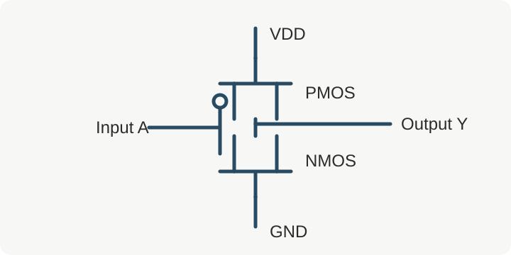

# CMOS 基础

CMOS（Complementary Metal-Oxide-Semiconductor）用互补的 PMOS 与 NMOS 网络实现逻辑功能。它是理解功耗、延迟和 [[学习笔记/数字电路/时序分析|静态时序分析]] 的器件级起点。

> [!abstract] 本页目标
> 建立从 MOS 管开关模型到 CMOS 反相器，再到动态功耗与传播延迟的完整直觉。

## MOS 管的开关模型

在第一轮理解中，可以把 MOS 管近似为受栅极电压控制的开关：

| 器件 | 导通条件（简化）                | 常见位置 | 擅长传输 |
| ---- | ------------------------------- | -------- | -------- |
| NMOS | $V_{GS} > V_{TN}$               | 下拉网络 | 强 0     |
| PMOS | $V_{SG} > \lvert V_{TP} \rvert$ | 上拉网络 | 强 1     |

==互补结构的关键== 是稳态时理想情况下只有一侧网络导通，因此静态功耗较低。

### 导通电阻

真实器件不是理想开关。导通电阻与负载电容形成近似的 RC 网络：

$$
t_{pd} \approx 0.69 R_{eq} C_L
$$

这条关系会在 [[学习笔记/数字电路/时序分析#建立时间与保持时间|建立时间和保持时间]] 的分析中再次出现。

## CMOS 反相器


_图 1：PMOS 上拉、NMOS 下拉组成的 CMOS 反相器。_

输入为低电平时 PMOS 导通，输出被拉高；输入为高电平时 NMOS 导通，输出被拉低。

```systemverilog title="inverter.sv"
module inverter (
  input  logic a,
  output logic y
);
  assign y = ~a;
endmodule
```

> [!warning] 不要混淆模型层次
> RTL 中的 `~a` 描述逻辑关系，并不会显式创建某一种晶体管尺寸。标准单元映射发生在综合阶段。

### 电压传输特性

反相器的电压传输曲线通常分为输出高电平区、转换区和输出低电平区。转换区越陡，噪声容限通常越好。

#### 噪声容限

噪声容限可写成：

$$NM_H = V_{OH} - V_{IH}, \qquad NM_L = V_{IL} - V_{OL}$$

##### 为什么需要留裕量

制造偏差、电源波动和串扰都会让实际信号偏离理想值。

###### 一句话记忆

数字电路的“0”和“1”是电压范围，不是两个精确电压点。

## 功耗

CMOS 功耗主要包括动态功耗、短路功耗和漏电功耗。动态功耗的常用近似是：

$$P_{dynamic} = \alpha C_L V_{DD}^{2} f$$

- $\alpha$：翻转活动因子
- $C_L$：等效负载电容
- $V_{DD}$：电源电压
- $f$：时钟或活动频率

> [!question] 自检
> 为什么降低电源电压对动态功耗特别有效？它又会给时序带来什么代价？

## 学习检查

- [x] 能解释反相器的上下拉路径
- [x] 能写出动态功耗近似式
- [ ] 结合 PVT corner 比较传播延迟
- [ ] 用 SPICE 绘制一条 VTC 曲线

## 延伸阅读

- 上一篇：[[学习笔记/数字电路/index|数字电路索引]]
- 下一篇：[[学习笔记/数字电路/时序分析|时序分析 Timing Analysis]]
- 相关笔记：[[学习笔记/SystemVerilog/基础语法|SystemVerilog 基础语法]]

[^1]: 这里采用一阶模型帮助建立直觉；精确分析还需要考虑短沟道效应、寄生参数与工艺模型。
